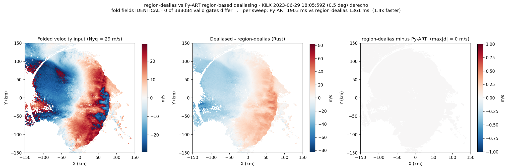

# region-dealias

Fast **region-based Doppler velocity dealiasing** — a Rust port of the core
(non-reference-anchored) path of [Py-ART](https://github.com/ARM-DOE/pyart)'s
`dealias_region_based`, with Python bindings.

The goal is **bit-identical** output to pyart on the path the
[NEXRAD Level 2 browser](https://github.com/swnesbitt/nexrad-level2-browser)
uses (`dealias_region_based(radar, vel_field="velocity", keep_original=False)`,
i.e. no `ref_vel_field`), but much faster — the slow part in pyart is the pure
Python `_EdgeTracker` network reduction, which is what Rust accelerates.

## Install

```bash
pip install region-dealias        # prebuilt manylinux / macOS wheels
```

## Use

Drop-in replacement for pyart on a `Radar` object:

```python
from region_dealias import dealias_region_based
corr = dealias_region_based(radar, vel_field="velocity", keep_original=False)
radar.add_field("corrected_velocity", corr)
```

Low-level, one sweep at a time (array in / fold-count out):

```python
import numpy as np
from region_dealias import sweep_folds

folds = sweep_folds(vel, mask, nyquist=25.0, rays_wrap_around=True)
dealiased = vel + folds * (2 * 25.0)
```

`vel` is `(nrays, ngates)` float32, `mask` is a bool array (True = excluded:
masked or non-finite). `folds` is the integer number of Nyquist intervals to
add at each gate.

## Scope

Implemented: the per-sweep region-network algorithm
(`interval_splits`, `skip_between_rays`, `skip_along_ray`, `centered`,
`rays_wrap_around`, per-sweep `nyquist_vel`).

**Not** implemented (the high-level wrapper raises `NotImplementedError` so
callers can fall back to pyart): `ref_vel_field` (sounding-anchored) unfolding,
custom `gatefilter`, and explicit `interval_limits`.

## Parity

`tests/test_parity.py` checks the Rust folds against a verbatim transcription of
pyart's algorithm (`tests/pyart_ref.py`) on hundreds of randomized synthetic
aliased sweeps plus edge cases, asserting exact integer equality. CI also checks
against the installed `arm_pyart` package. The certified pyart version is
recorded in CI; re-verify on pyart upgrades.

Identity relies on faithfully reproducing: `scipy.ndimage.label` numbering
(4-connectivity, first-encounter raster order), the Cython edge-finder
traversal order, the float32/float64 dtype chain, NumPy banker's rounding
(`round_ties_even`), and `argmax`-first-tie selection.

## Benchmark

Real-volume check on the 29 June 2023 Midwest derecho — KILX (Lincoln, IL),
18:05:59Z, lowest velocity sweep (0.5°, 720 × 1192 rays×gates, Nyquist
29.25 m/s, 388,084 valid gates):

- **Parity: 100%.** The Rust fold field is bit-identical to the Py-ART
  reference — **0 of 388,084 valid gates differ** (max|Δ| = 0 m/s).
- **Speed: ~1.4× faster** per sweep than the reference region-based algorithm
  (region-dealias ≈1.36 s vs Py-ART ≈1.90 s, best-of-N wall time).



Left: folded velocity input. Middle: dealiased by region-dealias. Right: the
difference vs Py-ART — uniformly zero across the sweep.

The baseline is the verbatim Py-ART algorithm in `tests/pyart_ref.py` (the same
oracle the parity tests use); Py-ART's region-network reduction is itself pure
Python, so this is a like-for-like comparison of that path. This sweep is only
lightly aliased (at most one Nyquist fold), which makes 1.4× a *conservative*
figure — the Rust advantage grows with the number and size of aliased regions.
Absolute times vary by machine.

Reproduce: `python benchmarks/benchmark_derecho.py <volume>` (the script header
has the one-line anonymous download for the exact volume).

## Layout

```
crates/core   # pure-Rust algorithm
crates/py     # PyO3 bindings (maturin)
python/       # region_dealias package (low-level + radar-compat wrapper)
tests/        # parity harness
```

## License

MIT
